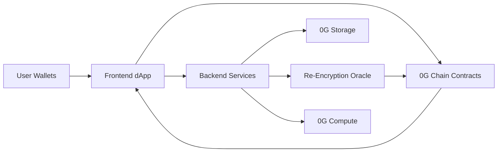

# INFT Agent Marketplace MVP Plan

Date: February 20, 2026
Project codename: AgentVault

## Objective
Build an on-chain marketplace where AI agents are minted as INFTs (ERC-7857 style), traded with encrypted intelligence transfer, and optionally leased for usage without ownership transfer.

## MVP Scope
- Mint INFT from encrypted agent metadata
- List and buy INFT on 0G testnet
- Re-encrypt metadata key for buyer during transfer
- Grant and revoke time-bound usage rights (leasing)
- Run agent inference via 0G Compute when caller has valid usage rights
- Show proof artifacts in UI (hashes, tx links, metadata root)

## Non-Goals (Hackathon)
- Full production-grade TEE infrastructure
- Full ZKP proving pipeline
- Complex DAO governance or tokenomics
- Multi-chain bridge support

## Architecture Decisions
### Chain Layer (0G Chain)
- Network for MVP: Galileo testnet (`chainId: 16602`, RPC `https://evmrpc-testnet.0g.ai`)
- Contracts:
  - `AgentINFT.sol`: ERC-721 + ERC-7857-style transfer with sealed key/proof + usage authorization
  - `AgentMarketplace.sol`: listing, purchase, fee split, royalty support
  - `MockTEEOracleVerifier.sol`: verifies oracle signatures and anti-replay nonce

### Data Layer (0G Storage)
- Store encrypted agent metadata blob off-chain on 0G Storage
- Store hash commitments on-chain:
  - `metadataHash`
  - `encryptedBlobRoot` or URI digest
- Metadata contains:
  - system prompt
  - tool config
  - model preference
  - version and capability descriptors

### Compute Layer (0G Compute)
- Inference gateway service checks license before execution
- If license valid, service decrypts permitted metadata and calls compute provider
- Return output + proof references to frontend

### Oracle/Re-Encryption Layer
- Off-chain oracle service performs:
  - decrypt original metadata key in secure service boundary
  - generate new data key
  - re-encrypt metadata for recipient
  - seal recipient key material
  - sign proof payload
- On-chain verifier checks signature, nonce, tokenId, recipient, new hash

### App Layer
- Frontend (React + Vite + TypeScript + wagmi/viem):
  - mint flow
  - list flow
  - buy flow
  - lease flow
  - “proof panel” (hashes + tx IDs + explorer links)
- Backend (Node + TypeScript + Express/Fastify):
  - encryption helpers
  - oracle service endpoint
  - compute proxy endpoint
  - rate limiting + request auth

## System Diagram


## End-to-End Flows
### Flow A: Mint
1. Creator submits agent config.
2. Backend encrypts metadata and uploads to 0G Storage.
3. Backend returns `encryptedURI`, `metadataHash`, `sealedKey`.
4. Creator calls `mintAgent(...)` on `AgentINFT`.
5. UI displays minted token and proof data.

### Flow B: Buy/Transfer
1. Seller lists token on marketplace.
2. Buyer clicks buy and sends payment.
3. Oracle prepares transfer proof + buyer sealed key.
4. Marketplace executes purchase + `transferWithMetadata(...)`.
5. Buyer receives ownership and decrypt capability.

### Flow C: Lease Usage
1. Owner calls `authorizeUsage(tokenId, user, expiry, permsHash)`.
2. User calls agent execution endpoint.
3. Backend checks on-chain usage rights and expiry.
4. Backend runs inference via 0G Compute and returns result.

## Security Baseline (MVP, Not Over-Engineered)
- Use audited OpenZeppelin base contracts
- Reentrancy guard on transfer/purchase paths
- Strict ownership checks for mint/transfer/authorize/revoke
- Oracle signature verification with domain separation + nonce replay protection
- Never store plaintext metadata on-chain
- Encrypt metadata with AES-256-GCM (or equivalent AEAD)
- Seal keys to recipient public key only
- Backend rate limiting for compute endpoints
- Environment secrets in `.env`, never in repo
- Basic abuse controls:
  - max input size
  - execution timeout
  - per-wallet request budget

## Suggested Repo Structure
```text
inft-agent-market/
  contracts/
    src/
      AgentINFT.sol
      AgentMarketplace.sol
      MockTEEOracleVerifier.sol
    script/
      Deploy.s.sol
    test/
      AgentINFT.t.sol
      AgentMarketplace.t.sol
  app/
    src/
      pages/
      components/
      hooks/
      lib/
        wagmi.ts
        contracts.ts
      styles/
  services/
    api/
      src/
        routes/
          mint.ts
          transfer-proof.ts
          execute.ts
        lib/
          crypto.ts
          storage.ts
          compute.ts
          oracle.ts
  docs/
    demo-script.md
    pitch-notes.md
```

## Delivery Plan (Markdown Checklist)
### Phase 0: Setup
- [ ] Initialize new project folders (`contracts`, `app`, `services`, `docs`)
- [ ] Configure `.env.example` with 0G endpoints and keys
- [ ] Configure wallet + chain in frontend (`16602`)
- [ ] Acceptance criteria: local app boots, wallet connects, chain displays correctly

### Phase 1: Smart Contracts
- [ ] Implement `AgentINFT.sol` (mint, transferWithMetadata, authorizeUsage, revokeUsage)
- [ ] Implement `AgentMarketplace.sol` (list, cancel, buy, royalty payout)
- [ ] Implement oracle verifier contract with nonce replay protection
- [ ] Write unit tests for mint/list/buy/authorize/revoke
- [ ] Acceptance criteria: all tests pass and contracts deploy to testnet

### Phase 2: Storage + Encryption
- [ ] Integrate 0G Storage upload/download in backend service
- [ ] Implement metadata encryption/decryption helpers
- [ ] Create mint API that returns `encryptedURI`, `metadataHash`, `sealedKey`
- [ ] Acceptance criteria: mint API produces deterministic hash and retrievable encrypted blob

### Phase 3: Transfer Proof Service
- [ ] Build oracle endpoint to re-encrypt metadata for buyer
- [ ] Sign proof payload (tokenId, recipient, newHash, nonce, expiry)
- [ ] Validate proof on-chain in transfer flow
- [ ] Acceptance criteria: purchase flow succeeds and old owner cannot decrypt new payload

### Phase 4: Usage Leasing + Compute
- [ ] Implement authorize/revoke usage UI + contract calls
- [ ] Implement execution endpoint with on-chain entitlement checks
- [ ] Integrate 0G Compute call path and return inference result
- [ ] Acceptance criteria: unauthorized user blocked, authorized user receives response

### Phase 5: Demo Hardening
- [ ] Add error states and transaction status UX
- [ ] Add proof panel with tx hash + metadata hash + storage root
- [ ] Write 3-minute demo script and backup script
- [ ] Acceptance criteria: full demo runs in one take on testnet wallet

## Dependencies Between Phases
- Phase 1 depends on Phase 0
- Phase 2 depends on Phase 0
- Phase 3 depends on Phases 1 and 2
- Phase 4 depends on Phases 1 and 2
- Phase 5 depends on Phases 1 through 4

## Definition of Done (Hackathon)
- One wallet can mint an AI agent INFT
- Second wallet can buy and receive functional access path
- Owner can lease access without selling ownership
- UI shows transparent proof trail for each step
- Demo video or live flow works end-to-end on 0G testnet
